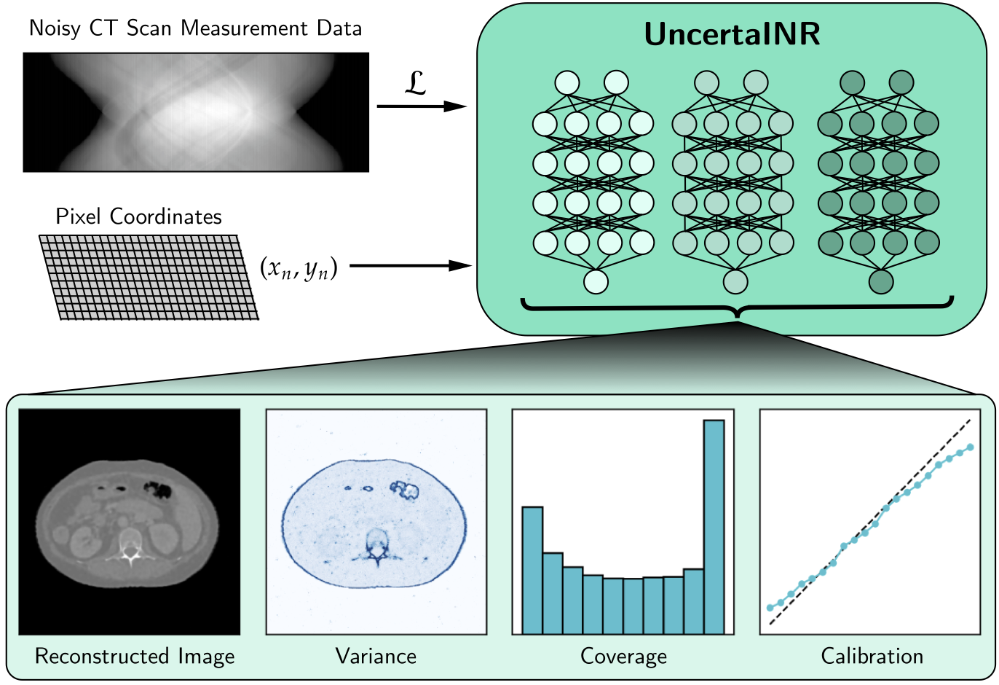
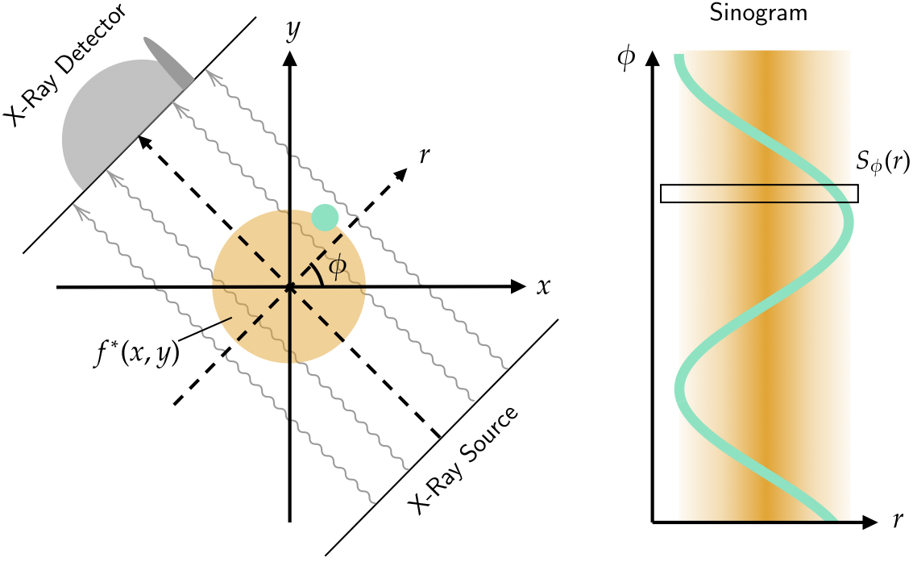

# UncertaINR: Uncertainty Quantification of End-to-End Implicit Neural Representations for Computed Tomography

[Francisca Vasconcelos](https://franciscavasconcelos.github.io/)\*<sup>1,2</sup>,
[Bobby He](https://bobby-he.github.io/)\*<sup>1</sup>,
[Nalini Singh](https://nalinimsingh.com/)<sup>3</sup>,
[Yee Whye Teh](https://www.stats.ox.ac.uk/~teh/)<sup>1</sup><br>
<sup>1</sup>University of Oxford, <sup>2</sup>UC Berkeley, <sup>3</sup>MIT, \*denotes equal contribution

Published in the *Transactions on Machine Learning Research* (April 2023).

### [Paper](https://arxiv.org/abs/2202.10847) | [Talk](https://www.youtube.com/watch?v=cD7Wx4F_EjQ) | [Slides](https://docs.google.com/presentation/d/1p8BiarRbX4bCV1jdgrylJrAEPtLS27StNtSvQcf4C0s/edit#slide=id.gfd1a964876_0_19) | [OpenReview](https://openreview.net/forum?id=jdGMBgYvfX)

---

This is the official implementation of the paper *"UncertaINR: Uncertainty Quantification of End-to-End Implicit Neural Representations for Computed Tomography"*. The repository is based off the [SIREN](https://github.com/vsitzmann/siren) codebase.


## Abstract
<p align="center">
     
</p>

Implicit neural representations (INRs) have achieved impressive results for scene reconstruction and computer graphics, where their performance has primarily been assessed on reconstruction accuracy. As INRs make their way into other domains, where model predictions inform high-stakes decision-making, uncertainty quantification of INR inference is becoming critical. To that end, we study a Bayesian reformulation of INRs, UncertaINR, in the context of computed tomography, and evaluate several Bayesian deep learning implementations in terms of accuracy and calibration.  We find that they achieve well-calibrated uncertainty, while retaining accuracy competitive with other classical, INR-based, and CNN-based reconstruction techniques. Contrary to common intuition in the Bayesian deep learning literature, we find that INRs obtain the best calibration with computationally efficient Monte Carlo dropout, outperforming Hamiltonian Monte Carlo and deep ensembles. Moreover, in contrast to the best-performing prior approaches, UncertaINR does not require a large training dataset, but only a handful of validation images.

## Repository & Code Specifics

### Get started
You can set up a conda environment with all dependencies like so:
```
conda create -n uinr python=3.8
conda activate uinr
pip install -r requirements.txt
```

For HMC experiments, we use [NumPyro](https://github.com/pyro-ppl/numpyro) which relies on [JAX](https://github.com/google/jax). More details on installing [JAX](https://github.com/google/jax) for your CUDA setup can be found [here](https://github.com/google/jax#installation).

You should also set up a [wandb](https://wandb.ai/site) account and set your wandb account as an environment variable from command line e.g.

```
export WANDB_API_KEY=example_key
```


### High-Level structure
The top-level scripts organized as follows:
* `_utils.py` contains utility functions, including saving results and plotting images.
* `dataio.py` loads training and testing data.
* `loss_functions.py` contains loss functions for our different experiments.
* `modules.py` contains layers and full neural network modules combined with uncertainty methods.
* `numpyro_port.py` contains
* `training.py` contains a generic training routine.

The folders are organized as follows:
* `./experiment_scripts/` contains scripts to reproduce experiments in the paper.
* `./conf/` contains nested [Hydra](https://hydra.cc/docs/next/intro) configurations, useful for managing experiment folders and setting configs for different training procedures.
* `./example_configs/` contains some example [wandb](https://wandb.ai/site) sweep configs with tuned hyperparameters. 
* `./data/` contains data from the [AAPM 2016 Low-Dose CT Grand Challenge](https://www.aapm.org/grandchallenge/lowdosect/) 
* `./checkpoints/` contains pre-trained checkpoints for both UINRs and Grid of Pixels on AAPM to initialize HMC runs.

### Usage
To start training an UINRs with [MCDropout](https://arxiv.org/abs/1506.02142) on [AAPM](https://www.aapm.org/grandchallenge/lowdosect/):
```
python experiment_scripts/run_uncertainr.py uncertainty=mc_dropout reg.coeff=0.008 model.omega_0=40 num_epochs=15000 data.test_set=True
```
which should take around an hour to run on an 12GB NVIDIA GeForce_GTX_2080Ti GPU. 

To start running inference on an UINR with HMC in [NumPyro](https://github.com/pyro-ppl/numpyro) on [AAPM](https://www.aapm.org/grandchallenge/lowdosect/):
```
python experiment_scripts/run_hmc_numpyro.py uncertainty=hmc model.width=200 model.depth=4 reg.coeff=0.03 model.omega_0=60 model.use_checkpoint=True data.test_set=True uncertainty.num_samples=500
```
which should take around 10 hours to run on an 24GB NVIDIA Titan RTX GPU. These hyperparameters are tuned and match those found in Table 8 of our paper.

## Project Overview

### Computed Tomography
We focused on the problem of image reconstruction in the medical setting of [computed tomography](https://en.wikipedia.org/wiki/CT_scan). Here, we are interested in reconstructing 2D images, represented as functions $f(x,y)$ of tissue attenuation coefficients at pixel locations $(x,y)$ within an imaging subject cross-section. For view-angles $\phi$ and X-ray detector radii $r$, CT scanners rotate X-ray emitters and detectors around the subject, collecting measurements of the Radon transform $S_\phi (r) $ of the desired image $f$ rather than actual image values $f(x,y)$. Since each measurement performed exposes the patient to harmful radiation, we aim to minimize the total number of view angles $\phi$ needed to reconstruct a high-quality image. However, this results in a noisy and sparse (underdetermined) sinogram, which makes learning the inverse Radon transform chalenging.

<p align="center">
     
</p>


### Model Architecture & Uncertainty Quantification

UncertaINR leverages an end-to-end INR, which learns a functional form of the reconstructed image. Sampling this function across muliple pixel coordinates and performing a Radon transform on the sampled image generates a "learned" sinogram, which is used to calculate a loss relative to the true sinogram data. In addition to hypertuning our models, crucial to achieving competitive model performance was: [Random Fourier Features](https://arxiv.org/abs/2006.10739) (RFFs), image-padding, and [total-variation](https://www.sciencedirect.com/science/article/abs/pii/016727899290242F) (TV) regularization.

UncertaINR is a Bayesian framework, achieving uncertainty quantification via inference over the INR parameters and/or image output, enabling prediction of an image distribution (as opposed to a singular image). We tested several uncertainty quantification approaches, namely: [Bayes-by-Backpropogation](https://arxiv.org/abs/1505.05424) (BBB), [Hamiltonian Monte Carlo](https://arxiv.org/abs/1701.02434) (HMC), [Monte Carlo Dropout](https://arxiv.org/abs/1506.02142) (MCD), and [Deep Ensembles](https://arxiv.org/abs/1612.01474) (DEs). BBB was implemented using [Blitz](https://github.com/piEsposito/blitz-bayesian-deep-learning) and HMC was implemented via the [No-U-Turn-Sampler](https://arxiv.org/abs/1111.4246) sampling scheme in [NumPyro](https://github.com/pyro-ppl/numpyro), which is based in [JAX](https://github.com/google/jax). 

<p align="center">
     
</p>


### Data
We performed our ablation study on a dataset of 256x256 2D artificially-generated [Shepp-Logan](https://ieeexplore.ieee.org/document/6499235) phantom images, implemented using [phantominator](https://github.com/mckib2/phantominator) (validation scan ids: 1-5, test scan ids: 6-10). We performed model comparison tests on a dataset of real 512x512 2D reconstructed scan images from the [AAPM 2016 Low-Dose CT Grand Challenge](https://www.aapm.org/grandchallenge/lowdosect/) (validation and test images included in the *data/* folder). Note that artificial Gaussian noise was added to the AAPM images (to achieve a 40dB SNR).

### Baselines
We compared UncertaINR to several baselines. Classical medical imaging reconstruction techniques (FBP, CGLS, EM, SIRT, and SART) were implemented using [TomoPy](https://github.com/tomopy/tomopy). State-of-the-art CT image reconstruction baseline results (FISTA-TV, FBP CoIL, FISTA-TV CoIL, FBP Unet, GM-RED, FBP Unet COIL, GM-RED COIL) were taken from the 2021 paper by Sun et al., *"[CoIL](https://arxiv.org/abs/2102.05181): Coordinate-based Internal Learning for Imaging Inverse Problems"*. 

Finally, as an uncertainty baseline, we implemented our architecture with a Grid-of-Pixels (GOP), replacing the INR. Given that this pixel-based representation did not leverage a neural network encoding, BBB, MCD, and DEs were not applicable. Thus, uncertainty quantification was only possible via HMC. 

### Results & Key Takeaways

<p align="center">
     
</p>

In this work, we proposed UncertaINR: a Bayesian reformulation of INR-based image reconstruction. In the high-stakes and well-motivated application of CT image reconstruction, UncertaINR attained ***calibrated uncertainty*** estimates ***without sacrificing reconstruction quality*** relative to other classical, INR-based, and CNN-based reconstruction techniques on realistic, noisy, and underdetermined data. In the context of INR UQ, contrary to common intuition, we found that ***simple and efficient MCD rivaled (even outperformed) the popular DEs and the sophisticated, yet computationally-expensive HMC methods***. UncertaINR's strategic use of INRs outperformed classical reconstruction approaches, while alleviating key challenges faced by state-of-the-art deep learning methods -- namely generalizability and small-scale medical datasets. In addition to informing doctor diagnoses, UncertaINR's well-calibrated uncertainty estimates could pave the way for reduced healthcare costs, via methods like automated triage, and reduced patient radiation exposure, via methods like active learning.


## Citation
If you find this work useful, please cite:
```
@article{vasconcelos2023uncertainr,
     title={UncertaINR: Uncertainty Quantification of End-to-End Implicit Neural Representations for Computed Tomography},
     author={Francisca Vasconcelos and Bobby He and Nalini Singh and Yee Whye Teh},
     journal={Transactions on Machine Learning Research},
     issn={2835-8856},
     year={2023},
     url={https://openreview.net/forum?id=jdGMBgYvfX},
}
```

